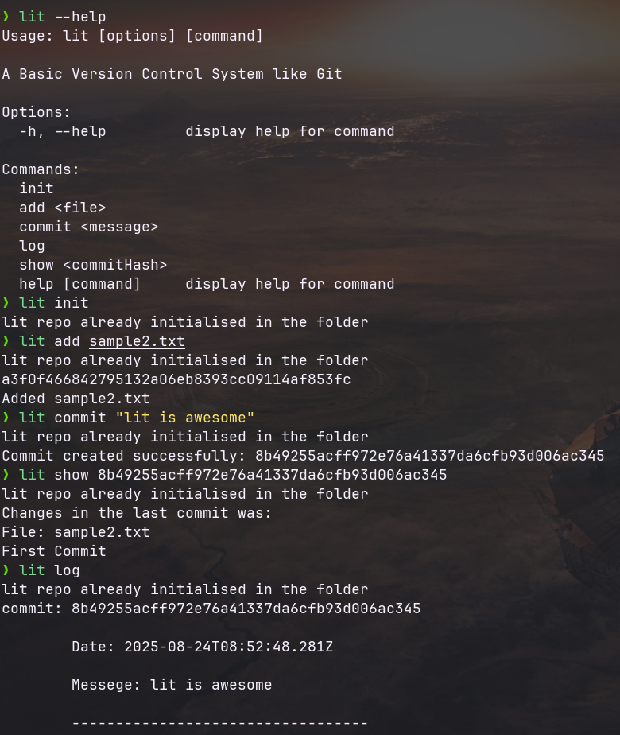

# Lit - A Lightweight Version Control System

Lit is a simple, Git-inspired version control system built in JavaScript. It provides basic version control functionality through a command-line interface, implementing core Git concepts like staging, committing, and viewing history.



## Features

- **Repository Management**: Initialize new repositories with `lit init`
- **Staging Area**: Add files to staging with `lit add <file>`
- **Commits**: Create commits with descriptive messages
- **History**: View commit history and changes with `lit log`
- **Diff Viewing**: See changes between commits with `lit show <commit-hash>`
- **Content Addressing**: Files and commits are stored using SHA-1 hashes

## Prerequisites

- Node.js (version 14 or higher)
- npm (comes with Node.js)

## Installation

### Option 1: Install Globally (Recommended)

1. Clone the repository:

```bash
git clone <repository-url>
cd lit-vcs
```

2. Install dependencies:

```bash
npm install
```

3. Install the `lit` command globally:

```bash
npm install -g .
```

Now you can use `lit` from anywhere in your system!

### Option 2: Development Setup

1. Clone and install dependencies:

```bash
git clone <repository-url>
cd lit-vcs
npm install
```

2. Create a symlink for development:

```bash
npm link
```

3. Make the script executable:

```bash
chmod +x main.mjs
```

## Usage

### Initialize a Repository

```bash
lit init
```

Creates a new `.lit` repository in the current directory. This sets up the internal structure needed for version control.

### Add Files to Staging Area

```bash
lit add <filename>
```

Adds the specified file to the staging area. The file content is hashed and stored in the objects directory.

**Example:**

```bash
lit add main.js
lit add README.md
```

### Commit Changes

```bash
lit commit "Your commit message here"
```

Creates a commit with all files currently in the staging area. The staging area is cleared after a successful commit.

**Example:**

```bash
lit commit "Add initial project setup"
lit commit "Fix bug in file handling"
```

### View Commit History

```bash
lit log
```

Displays a chronological history of all commits, showing commit hashes, timestamps, and messages.

### Show Commit Diff

```bash
lit show <commit-hash>
```

Shows the differences introduced in the specified commit, displaying added lines in green and removed lines in red.

**Example:**

```bash
lit show abc123def456
```

## Project Structure

When you initialize a repository, Lit creates the following structure:

```
.lit/
├── objects/     # Stores file content and commit objects (SHA-1 hashed)
├── HEAD         # Points to the current commit hash
└── index        # Tracks staged files (JSON format)
```

## How It Works

Lit implements a simplified version of Git's internal model:

1. **Content Addressing**: All file content is hashed using SHA-1 and stored in the `objects/` directory
2. **Staging Area**: The `index` file tracks which files are staged for the next commit
3. **Commits**: Each commit contains metadata (timestamp, message, parent) and references to file hashes
4. **History**: Commits form a linked list, with each commit pointing to its parent
5. **HEAD**: The `HEAD` file always points to the latest commit

## Example Workflow

```bash
# Initialize a new repository
lit init

# Add some files
lit add main.js
lit add package.json

# Make your first commit
lit commit "Initial project setup"

# Make some changes to files, then add and commit again
lit add main.js
lit commit "Add new feature"

# View your commit history
lit log

# See what changed in the last commit
lit show <latest-commit-hash>
```

## Development

### Project Structure

```
lit-vcs/
├── main.mjs          # Main CLI application
├── package.json      # Project configuration and dependencies
└── README.md         # This file
```

### Dependencies

- **commander**: Command-line interface framework
- **chalk**: Terminal color formatting
- **diff**: Text diffing functionality

### Running Tests

Currently, the project doesn't have automated tests, but you can test functionality manually using the commands above.

## Contributing

1. Fork the repository
2. Create a feature branch
3. Make your changes
4. Test thoroughly
5. Submit a pull request

## License

This project is licensed under the ISC License.

## Acknowledgments

This project is inspired by Git and serves as a learning tool to understand version control system internals.
